# CSE 151A - AI-Driven Grading: Automating Pokémon Card Valuation with Machine Learning

## Milestone 5 - Final Submission

## Introduction

The objective of this project is to develop a machine learning model that accurately predicts the grade and quality of a Pokémon trading card based solely on its image. Pokémon card grading is a cornerstone of the massive trading card collecting community, which blends nostalgia, fandom, and the allure of high-value collectibles. As fans of both Pokémon and the world of trading card collecting, we recognize how grading defines the value of a card. For instance, a single pristine card can be worth thousands of dollars, while a slightly damaged version of the same card might only be worth pennies. This vast discrepancy in value underscores the importance of accurate and reliable grading.

However, the current grading process is far from perfect. It involves sending cards to one of a few respected grading companies, such as PSA, BGS, or CGC, and waiting weeks—if not months—for the results. Additionally, the cost per card can quickly add up, making the process both time-consuming and expensive for collectors. Moreover, human graders, while skilled, can introduce variability, subjectivity, or even occasional errors into the grading process.

Our model aims to provide an accessible and efficient alternative by analyzing an image of a trading card and outputting a predicted grade along with a confidence score. This can serve as a preliminary assessment for collectors, helping them decide whether a card is worth submitting for professional grading. By empowering collectors with immediate and objective feedback, this tool can streamline the decision-making process and reduce unnecessary grading submissions.

Beyond the immediate application, this project highlights the broader potential of machine learning in collectible markets. A highly accurate predictive model could revolutionize how collectible items like trading cards, coins, stamps, or even sports memorabilia are valued and authenticated. Such models could democratize grading by removing barriers like cost and wait times, making it accessible to a wider audience. Additionally, it could standardize grading practices, reduce human subjectivity, and foster greater transparency and trust in collectible markets.

The broader implications of this work extend beyond collectibles. By leveraging computer vision and machine learning to assess physical objects, industries such as quality control, art appraisal, and antiques authentication could also benefit. For example, automating the evaluation of physical goods could lead to faster, more accurate, and scalable assessments in fields where manual inspection has long been the standard.

## Methodology

### Data Collection and Exploration

It is important to note that the relevant data was not readily available as a cleaned dataset, but had to be scraped ourselves. We achieved this by scraping data from eBay via searching for 10 most valuable cards in each Pokemon TCG set (since 11/3/24) for PSA grades 10, 9, 8, and 7. The list of cards we used can be found [here](https://docs.google.com/document/d/1S45M2bVT3rBX15cnimlXmRDwiepWfXl3hs9HDs8nDyU/edit?usp=sharing). For each combination, we attempted to download 2 images. The implementation of this can be found in this [listings.py](https://github.com/brendan887/pokemon-card-grader/blob/dcbc5826322a446d75970e0d47492690d8c5b451/listings.py).

We were able to achieve the following distribution of cards by using our chosen list of top 10 most valuable cards per set.

| Feature               | Count |
| --------------------- | ----- |
| Pokemon               | 789   |
| Trainer               | 189   |
| Full Art              | 187   |
| Non-Full Art\*        | 791   |
| GX                    | 72    |
| EX\*\*                | 216   |
| V                     | 42    |
| VMAX                  | 45    |
| Total Different Cards | 978   |

_Table 1: Feature distribution in chosen set of Pokemon cards_

\*Some cards can have art spanning the card, but are not offically "Full Art" cards
\*\*There are multiple generations of different types of EX cards, so this number is higher. It is difficult to check the exact distribution between these generations without manually verifying each card.

We were able to collect the following number of cards for each PSA grade using our strategy. Note that not all images are in this repository given the size of the files.

| Class          | Count |
| -------------- | ----- |
| PSA 10         | 1152  |
| PSA 9          | 1292  |
| PSA 8          | 981   |
| PSA 7          | 536   |
| Total Examples | 2357  |

_Table 2: Initial class distribution in collected images_

Though we succeeded in gathering the images of Pokemon cards of different grades as required by our objective, the data consists of problems that we later encountered when working with and training models on our dataset.

### Initial Data Preprocessing

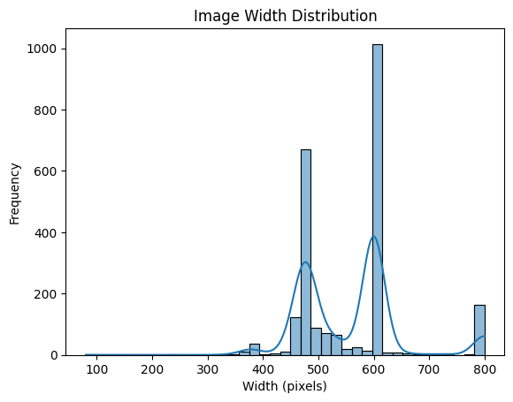
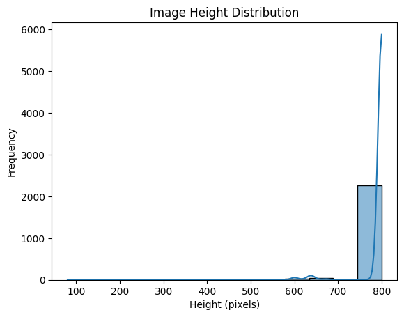

_Figure 1: Distribution of image dimensions in collected dataset_

For typical computer vision classification models, the input image size must be constant across all examples. Following our analysis of image dimensions as shown in Figure 1, we found the most common dimensions of images in our dataset ~600x800 at a 0.75:1 aspect ratio. We decided to fit all images in our dataset into size 384x512 which maintains this aspect ratio, but reduces resolution slightly to improve efficiency of model training. This was achieved by scaling all images to fit within the dimensions while preserving their original aspect ratios, and then filling background with black if left. All 3 input channels (RGB) was used.

As we are working with image data, each image has pixel values ranging from 0-255. Min-max normalization is used to scale values to 0-1. To improve generalizability of models, we also introduced data augmentation strategies, including minute shifts, rotations, and flipping left-right and top-bottom of training images.

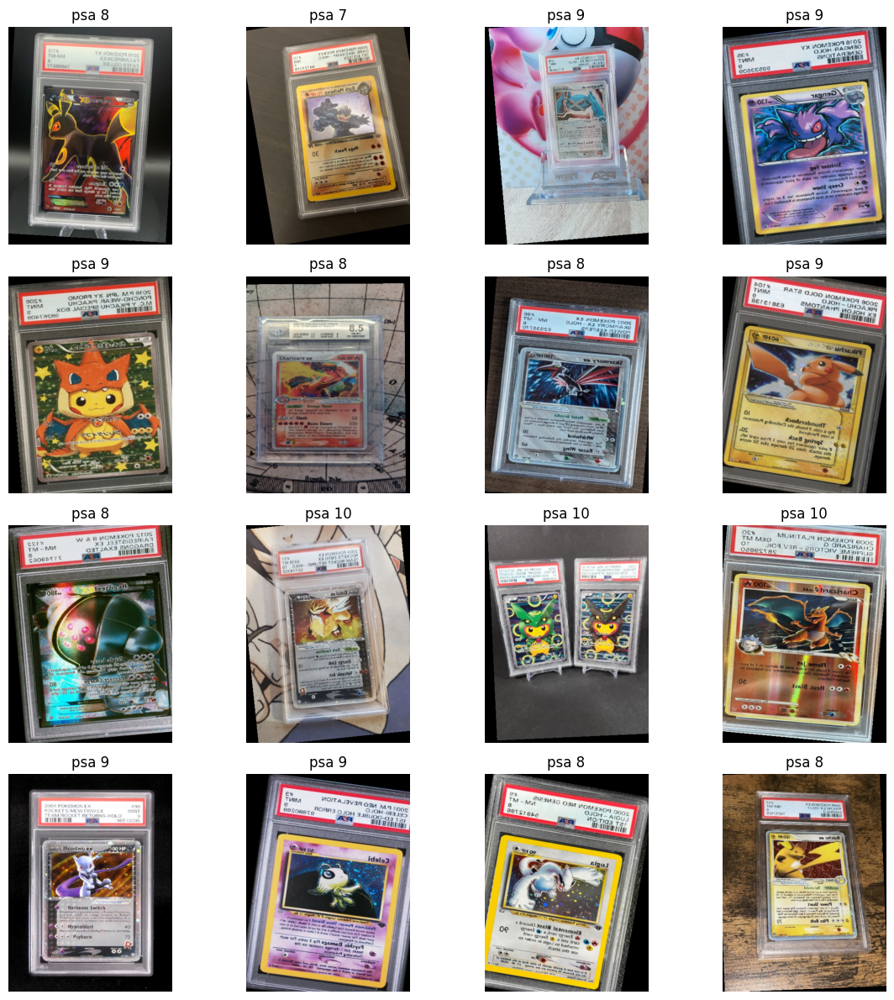

_Figure 2: Visualization of initial dataset following processing and augmentations_

PSA 10, 9, and 8 classes were downsampled to match the example count of PSA 7 such that training and validation sets were well distributed.

### Model 1: [Transfer Learning with ResNet50 on Initial Dataset](https://github.com/brendan887/pokemon-card-grader/blob/dcbc5826322a446d75970e0d47492690d8c5b451/model.ipynb)

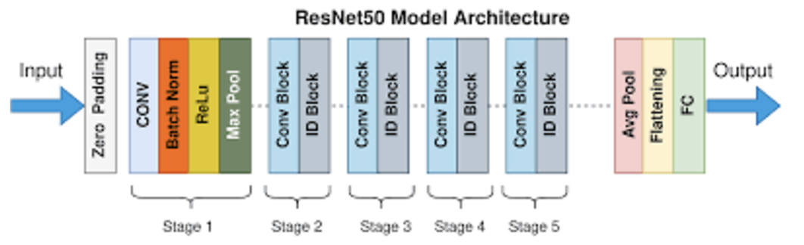

_Figure 3: ResNet50 model architecture_

Our first model involves transfer learning on ResNet50. ResNet50 is a model with 50 layers (each layer corresponding to a 'block' as shown in Figure 3). This was achieved by freezing all weights of the initialized ResNet50 model, and adding the following layers to the head of the model:

- Fully-connected layer (In-features of ResNet50 to 1024)
- ReLU activation function
- Dropout (p of 0.5)
- Fully-connected layer (1024 features to 4; corresponding to each class/PSA grade)

This approach utilizes the representations that are already learned by ResNet50, and maps these representations identified in our Pokemon card dataset to the classes.

The model was trained and validated for 10 epochs using a 80-20 train-validation split. The learning rate of 1e-4 paired with the Adam optimizer and the loss function of categorical cross-entropy was used.

### Model 2: [3-Layer CNN on Initial Dataset](https://github.com/brendan887/pokemon-card-grader/blob/dcbc5826322a446d75970e0d47492690d8c5b451/model2.ipynb)

For our second model, we tested a comparitively small model utilizing 3 convolutional layers, eaching consisting of a convolution and max pooling operation. This is following by an average pooling layer, a fully-connected layer with ReLU, and a final fully-connected layer that maps to each class.

The same 80-20 train-validation split was used to train the model for 10 epochs, using sparse categorical cross entropy, the Adam optimizer, and a higher learning rate of 1e-3.

### Additional Data Processing: [Segmentation and Flattening of Cards in Dataset](https://github.com/brendan887/pokemon-card-grader/blob/dcbc5826322a446d75970e0d47492690d8c5b451/segement_images.ipynb)

For MS5, in addition to the training new models, further data processing was applied in an attempt to improve model accuracy, specifically cropping cards out from the images. This was achieved by training a YOLO11 segmentation model to create segementation masks for cards in each image of our dataset, followed by cropping out and warping the card to flatten it. The implementation of this pipeline is not discussed in detail as we were told this is beyond the scope of our classification project.

A portion of the processed dataset is shown in Figure 4.

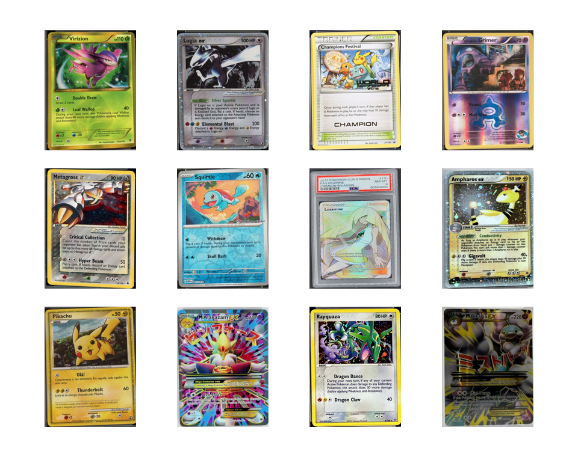

_Figure 4: Visualization of dataset following segmentation and cropping_

This pipeline enabled us to identify and discard images containing more than 2 cards. The segmentation model is also not perfect and could not identify the card or create clean segmentation masks that approximate a quadrilateral with complete accuracy. Examples that could not be cropped and flattened successfully were also discarded.

| Class          | Count |
| -------------- | ----- |
| PSA 10         | 550   |
| PSA 9          | 651   |
| PSA 8          | 512   |
| PSA 7          | 318   |
| Total Examples | 2031  |

_Table 3: Class distribution following segmentation_

To handle the resulting reduced dataset size and class imbalance, random sampling and data augmentation (slight rotation, transformation, and vertical and horizontal flips) were employed, as compared to downsampling used in the original dataset. It should be noted that the data augmentation is applied on train time, so different augmentations can be applied to the same example image to prevent memorization of the dataset. The train-validation split was also amended to 90-10.

### Model 3: [Transfer Learning with ResNet50 on Segmented Dataset](https://github.com/brendan887/pokemon-card-grader/blob/dcbc5826322a446d75970e0d47492690d8c5b451/ms5_resnet.py)

(Note that the model is in a Python script as we experienced issues running as notebook.)

Similar to model 1, transfer learning with ResNet50 was used with the same head structure with the exception that the new dataset was used. The model was trained for 20 epochs on a higher learning rate of 1e-3.

### Model 4: [ResNet-like CNNs of Varying Depths on Segmented Dataset](https://github.com/brendan887/pokemon-card-grader/blob/dcbc5826322a446d75970e0d47492690d8c5b451/ms5_variable_depth.py)

To explore smaller models more extensively, CNNs of depths 1, 2, 5, 10, 15, 20, and 30 were trained. The depth corresponds to the number of blocks included in the CNN, each containing a convolutional layer, batch norm, RELU, convoluation layer, batch norm, and downsampling depending on the depth to maintain correct dimension sizes. These layers are followed by average pooling and a fully-connected layer to map to the 4 classes. Each model was trained for 20 epochs, with a patience of 10 based on the validation accuracy.

## Results Section

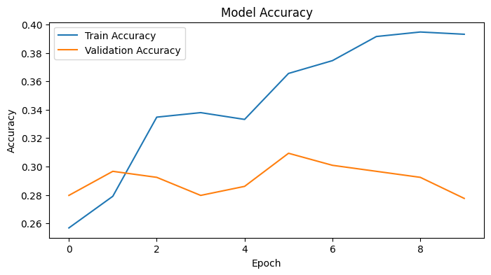
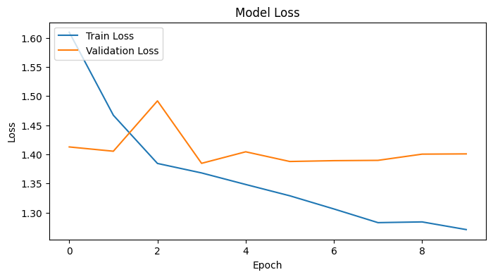

_Figure 5: Accuracy and loss for Model 1 (ResNet50 on initial data)_

Model 1 is able to converge on the train set as demonstrated by decreasing training loss. However, validation accuracy does not increase. A validation accuracy of 0.3093 is reached.

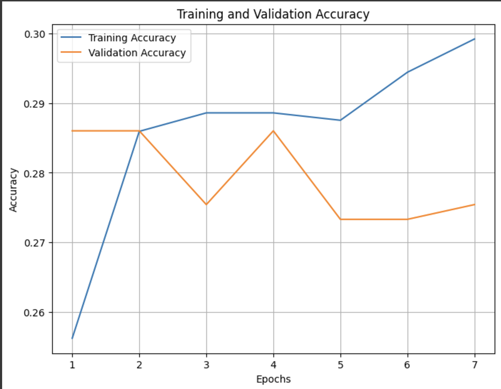
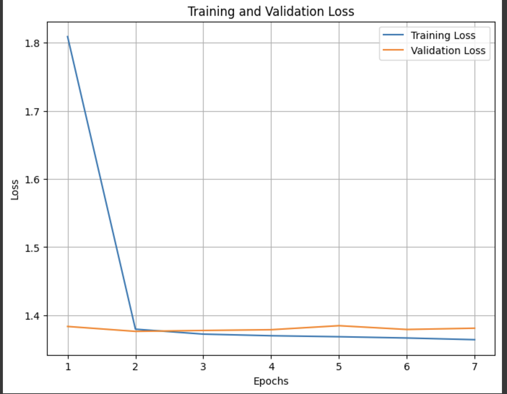

_Figure 6: Accuracy and loss Model 2 (3-Layer CNN on initial data)_

Model 2 does not demonstrate continuous decrease in train loss and train accuracy similarly does not improve much over epochs. Validation accuracy of ~0.297 is reached.

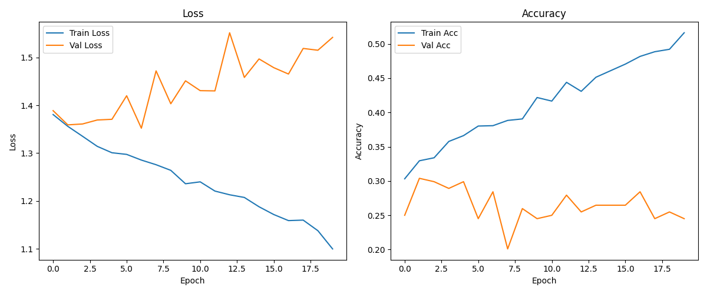

_Figure 7: Accuracy and loss for Model 3 (ResNet50 on segmented data)_

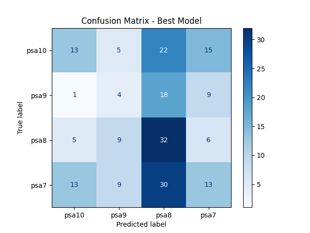

_Figure 8: Confusion matrix for Model 3_

Similar to Model 1, train loss decreases over epochs and validation accuracy does not steadily increase. A high validation accuray of ~0.3093 is reached.

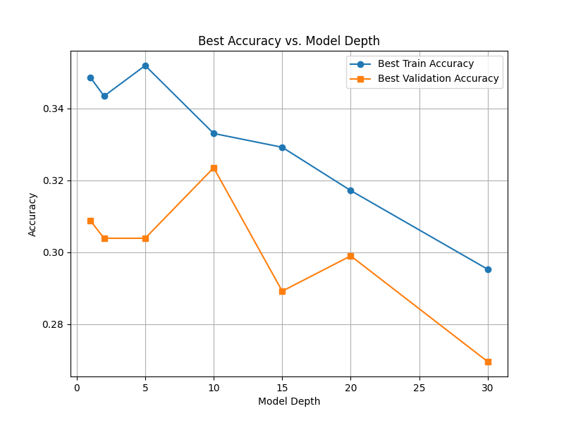

_Figure 9: Accuracy against model depth for Models 4 (on segmented data)_

Train and validation accuracy against model depth appears to follow a decreasing trend, as shown in Figure 9. The highest validation accuracy of 0.325 is achieved at a model depth of 10. The train and validation accuracy against epochs for this model can be seen in Figure 10.

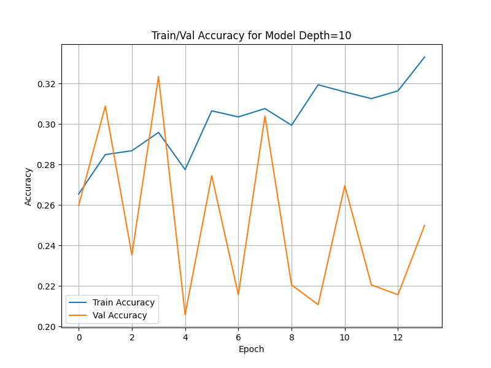

_Figure 10: Accuracy for Model 4 of depth 10_

## Discussion Section

### Data Processing

- We chose to use the list of 10 most valuable cards for each set as we believed that this would create a dataset representative of the different features of Pokemon cards that affect the appearance of the card, such as type and generation.
- As seen in Figure 2, examples in initial dataset can be noisy, i.e. backgrounds and skewing of cards that are not relevant to the actual classification task
- We segmented and flattened cards in order to isolate the cards from the background (reduce noise of dataset), while attempting to retain all of the card
- Initial dataset shows PSA labels, which gives more information to the model than it should have -> this can explain why there is not a marked increase in accuracy following segmenting and cropping out cards, in addition to less datapoints following segmentation
- Model 3 could have been trained for longer; loss is still decreasing, maybe may increase validation accuracy (though not necessarily)

### Model 1: Resnet50 Transfer Learning:

ResNet50 is a deep convolutional neural network that has been pre-trained on ImageNet, a massive dataset containing millions of labeled images across thousands of categories. It is widely recognized for its ability to extract robust and diverse visual features, and is a good general classifier.

- **Depth of the Model:** ResNet50 has 50 layers, making it deep enough to learn intricate patterns in image data. This depth is especially useful for distinguishing subtle differences in image quality, such as detecting fine scratches, centering, and surface imperfections in Pokémon cards.

Transfer learning allows the use of a pre-trained model like ResNet50 as a feature extractor. This is especially helpful for projects with smaller datasets, like this Pokémon card grading project.

- The pre-trained ResNet50 model already learned generic features like edges, shapes, and textures from ImageNet. These features are applicable to Pokémon cards, as they also involve distinguishing visual details.

The model accuracy indicates that it is only slightly better than random selection (there are 4 classes; random would be ~0.25). However, rather than improving the classification model itself, we put our effort towards further processing the dataset. Given the task of classification into different grades, the only pertinent information in a given image is the card itself. Looking at the preview of the data augmentation, we can see some issues:

- Some images have more than one card included
- Cards can be highly skewed
- Size of cards in images may vary
- Some images include irrelevant information (i.e. background)
- PSA label contains information of the card class, which should not be given to the model

As the task at hand relies on analyzing the card itself in great detail, we need to be able to eliminate the above factors. A solution we implemented is a segmentation model to crop out and flatten cards from the image, and identify and discard images with multiple cards/no cards/no unobstructed cards.

### Model 2: Convolutional Neural Network (CNN)

The CNN model was chosen as our second model for this project because of its ability to extract spatial features from image data. Convolutional layers allow the model to capture critical visual patterns such as edges, textures, and gradients that directly relate to Pokémon card grading criteria (e.g., centering, surface condition, corners, and edges).

The design of the CNN was intentionally kept lightweight with three convolutional layers, pooling layers, and dense layers. This simplicity was meant to:

- Prevent overfitting, considering the relatively small dataset size.
- Strike a balance between computational efficiency and feature extraction capacity.

The input image size (384×512) was chosen to preserve enough detail for grading while remaining computationally feasible. A Flatten layer followed by a fully connected dense layer was used for classification into the four grading categories.

However, the design process involved several iterations. Initial architectures were too shallow, resulting in underfitting, while deeper architectures led to overfitting due to limited data.

The CNN model achieved modest training and validation accuracy, which revealed certain trends:

**Believability of Results:** The model showed steady improvement in training accuracy over epochs, but validation accuracy plateaued early, suggesting limited generalization capacity. This aligns with expectations for a custom-built CNN applied to a domain-specific dataset.

**Shortcomings in Accuracy:** While the CNN learned basic patterns, it struggled with fine-grained distinctions between similar grades (e.g., PSA 9 vs. PSA 10), likely due to insufficient high-quality training data for these subtle variations.

The confusion matrix highlighted the model's strengths in distinguishing dissimilar grades but revealed a higher rate of false positives and false negatives for adjacent grades, reflecting inherent challenges in the grading task.

### Improvements/Criticisms

- Larger dataset: following segmentation we had a total of ~2000 examples, more data would have been useful especially to train uninitialized models (i.e. not transfer learning with resent). Unfortunately the webscraping to gather data became more time consuming than me anticipated.
- More balanced dataset: there were approximately 550, 650, 500, 320 examples for grades 10, 9, 8, 7 respectively, and we used random sampling + data augmentation, but simply having more balanced data would be good. Class imbalance might be because there are more people listing PSA 10 and 9 compared to lower grades.
- higher resolution images: get more information of minute details that determine grade. This might mean having physical cards in our presence in order to take high quality pictures.
- More consistent segmentation: segmented dataset much better isolates the cards but some examples are not perfect
- Use front and back of card as one example: grade is determined by both front and back. Most online listings include an image of the back but we didn't factor this in.
- Architecture Limitations: While lightweight, the model lacked the depth and complexity to fully capture subtle visual cues, such as minuscule scratches or centering deviations. The use of a Flatten layer contributed to a high number of parameters in the dense layers, making the model prone to overfitting despite its overall simplicity.
- Overfitting Risks: The training curves revealed a narrowing gap between training and validation accuracy, but overfitting remained a concern, especially when the model was exposed to limited data.

## Conclusion

The process of data collection for this project was one of the most challenging aspects. Pokémon card grading is a highly niche domain, and publicly available datasets simply do not exist. To build our dataset, we relied heavily on web scraping platforms like eBay to gather images of cards with corresponding grades. While this approach allowed us to create a dataset from scratch, it introduced several limitations. Many images scraped were of inconsistent quality, varied lighting conditions, and different angles, which may have negatively impacted the model's ability to learn grading-specific features. Additionally, data imbalance—where certain grades like PSA 10 were more common than others—likely skewed the model's predictions, as it struggled to generalize across all grades.

With more time and resources, a more rigorous approach to data collection could have significantly improved the results. For instance, partnering with collectors or grading companies to access high-quality, standardized images with verified grades would have provided a more robust foundation for training. Furthermore, supplementing the dataset with artificial data augmentation, such as cropping, rotation, and color adjustments, could have enhanced the model's ability to handle real-world variability. These improvements would likely result in higher accuracy and greater confidence in predictions, particularly for edge cases where the model struggled to differentiate between adjacent grades.

Overall, this project was an exciting first step toward automating Pokémon card grading. While the results demonstrate the potential of machine learning in this domain, they also highlight the critical importance of high-quality data in driving model performance. Looking ahead, future efforts could focus on refining the dataset, exploring more advanced architectures like attention-based models, and expanding the scope to include other collectibles. By addressing these areas, we can push closer to a practical and scalable solution for collectors and enthusiasts alike.

## Statement of Collaboration

## Milestone 4 - Model 2 and Evaluation

Image processing, model training, and evaluation can be found in [model2.ipynb](https://github.com/brendan887/pokemon-card-grader/blob/main/model2.ipynb).

We decided to try using a Convolutional Neural Network (CNN) model to see if we could see different results. This consisted of the same image processing of the first model, but used a different architecture to look at our data. Online research showed that Convolutional Neural Networks (CNN) are the most suitable choice for image-based tasks like ours. It's benefits include: feature extraction from images, parameter efficiency, etc.

### Image Processing

This remains the same as it did for our first model.

The most common dimensions are ~600x800 at a 0.75:1 aspect ratio. We decided to fit the images into size 384x512 which maintains this aspect ratio and improves efficiency of training. This was achieved by scaling all images to fit within the dimensions while preserving their original aspect ratios, and then filling the background with black.

Some simple data augmentation was also applied to the images, including small shifts, rotations, and flips. This is beneficial for CV models to improve generalizability.

### Training and Validation

### Evaluation

#### Training Accuracy:

The training accuracy starts relatively low and slowly increases over the epochs, but the increase is very modest, with final accuracy just around 30%.
This indicates that the model is learning but very slowly.

#### Validation Accuracy:

The validation accuracy fluctuates throughout the epochs without a clear upward trend.
It also remains quite low, hovering around 28–30%.

The low and fluctuating validation accuracy indicates that the model struggles to generalize to unseen data.

### Training Loss:

The training loss sharply decreases in the first epoch and then stabilizes, but remains relatively high.
This shows that the model is learning but not optimally.

### Validation Loss:

The validation loss remains relatively flat and doesn't show significant improvement. It even seems to slightly diverge from the training loss in later epochs.

- Underfitting: The model is not complex enough to capture the patterns in the data.
- Insufficient Training Data: The dataset might be too small for the model to learn effectively. Although I don't think this is the case as we have a sufficent amount of data images.

### Suggestions for Improvement

It is evident that our model is insufficient to make accurate predictions on our data. Given our observations, here are some possible directions that we hope to investigate for our next milestone:

- Increased depth of model if continuing with CNN: the model cannot capture the required patterns in the data required to make accurate predictions, as discussed previously, though this is unlikely to achieve much better accuracy
- Oversampling when training: the model can be trained with more than one instance for each card with different sets of augmentations (the current training methodology involves only one instance of each card with one set of augmentations)
- Using a vision transformer model: according to our research, ViTs tend to work better with larger datasets, which may beneficial especially if we adopt an oversampling strategy (above) that significantly grows the dataset
- Models with two input heads: the grading of a card relies on both the front and back of a card; our current implementation only takes the front as input. A model with two input heads can potentially be employed to take both the front and back images of an instance simultaneously to make a prediction. Similarly, a front and back image of a card instance can be concatenated and pass in as one input image. This would be a highly intensive and challenging iteration as it would require collection of corresponding back images for the cards in our dataset, and a model with two heads is a lot of additional complexity and may be unstable.

### Predictions of Correct and FP and FN

More details on this can be found at the end of the notebook in [model2.ipynb](https://github.com/brendan887/pokemon-card-grader/blob/main/model2.ipynb). Here we calculate the predictions and build a confusion matrix. We also visualize some of the FP/FN, as well as correct predictions.

### Conclusion

For this milestone, we attempted to create our own CNN model rather than transfer learning to control the complexity of the model. This has also allowed us to address batch size issues with ResNet50 that led to epochs with 0 accuracy during training last milestone - this has now been amended by using our own model.

The direction we took with this model was to test our data-to-model complexity alignment. This is because our previous iteration used ResNet50 - a model that generally excels at classification - with transfer learning, which achieved a relatively low accuracy. As such, we attempted a shallower CNN to experiment if the large model was too complex to converge. Comparing results between both models, there is no marked difference. From this observation, we can likely conclude that a standard CNN will be ineffective regardless of model complexity/depth. In addition to the suggetions for improvement, additional models in the pipeline may be useful for improving results, such as an additional classification model that verifies if a card is evident in an image and roughly exceeds a certain image.

## Milestone 3 - Preprocessing

Image processing, model training, and evaluation can be found in [model.ipynb](https://github.com/brendan887/pokemon-card-grader/blob/main/model.ipynb).

In this milestone, we completed data scraping as proposed in MS2. As we're working with image data, it is necessary to standardize the image size.

### Image Processing

The most common dimensions are ~600x800 at a 0.75:1 aspect ratio. We decided to fit the images into size 384x512 which maintains this aspect ratio and improves efficiency of training. This was achieved by scaling all images to fit within the dimensions while preserving their original aspect ratios, and then filling the background with black.

Some simple data augmentation was also applied to the images, including small shifts, rotations, and flips. This is beneficial for CV models to improve generalizability.

### Training and Validation

ResNet50 was used for transfer learning.

The best validation accuracy achieved was 0.3093 with a corresponding train accuracy of 0.3876.

### Where does your model fit in the fitting graph?

Train Loss (blue line):

- Consistently decreases over epochs, which means the model is learning on the training data.

Validation Loss (orange line):

- Decreases initially but starts to plateau and fluctuate, with a gap forming between the training and validation loss.

This pattern suggests that the model might be slightly overfitting. The model is performing well on the training data (low training loss) but struggles to generalize as indicated by the validation loss not decreasing at the same rate or fluctuating.

### What are the next models you are thinking of and why?

We can't fully conclude which model improvements need to made here. However we can start to think about using pre-existing image models using transfer learning with ResNet or train a custom UNet from scratch. We can also include L1/L2 regularization to address overfitting, this could help our model generalize better.

### Conclusion

The model accuracy indicates that it is only slightly better than random selection (there are 4 classes; random would be ~0.25). However, rather than improving the classification model itself, we propose further processing the dataset. Given the task of classification into different grades, the only pertinent information in a given image is the card itself. Looking at the preview of the data augmentation, we can see some issues:

- Some images have more than one card included
- Cards can be highly skewed
- Size of cards in images may vary
- Some images include irrelevant information (i.e. background)
- PSA label contains information of the card class, which should not be given to the model

As the task at hand relies on analyzing the card itself in great detail, we need to be able to eliminate the above factors. A solution is a segmentation model to crop out and flatten cards from the image, and identify and discard images with multiple cards/no cards/no unobstructed cards.

As for the model itself, more experimentation on architectures can be conducted, including training our own model from scratch.

## Milestone 2 - Data Exploration and Initial Processing

Since we are scraping our own data, we can design our own dataset as a preprocessing step. This way, we ensure that the dataset is representative of cards that we are interested in and has a sufficient representation of cards with different features. These features include but are not limited to:

- Card type (Pokemon vs. trainer)
- Art size (half art vs. full art)
- Special variant (EX, GX, VMAX, etc.)

We have decided to scrape card images for **the top 10 most valuable cards for each set** as of 11/3/24 (with the exception of few cards that have a completely different appearance to standard cards), with a total of 978 different cards. The complete card list can be found in [here](https://docs.google.com/document/d/1S45M2bVT3rBX15cnimlXmRDwiepWfXl3hs9HDs8nDyU/edit?usp=sharing). Significant effort was required to generate this list, as well as to create a cleaned version available in `config.py`. This query provides a good distribution of cards as it automatically includes cards for each generation and the special variants for each of these generations.

For each card, we have attempted to collect 2 images for each of the following classes, though not all grades were found for each card.

- PSA 10
- PSA 9
- PSA 8
- PSA 7

This ensures that the distribution of data between classes is close to even.

### Feature Distribution

| Feature               | Count |
| --------------------- | ----- |
| Pokemon               | 789   |
| Trainer               | 189   |
| Full Art              | 187   |
| Non-Full Art\*        | 791   |
| GX                    | 72    |
| EX\*\*                | 216   |
| V                     | 42    |
| VMAX                  | 45    |
| Total Different Cards | 978   |

\*Some cards can have art spanning the card, but are not offically "Full Art" cards

\*\*There are multiple generations of different types of EX cards, so this number is higher. It is difficult to check the exact distribution between these generations without manually verifying each card.

### Class Distribution (Collection in progress)

| Class          | Count |
| -------------- | ----- |
| PSA 10         | 214   |
| PSA 9          | 280   |
| PSA 8          | 256   |
| PSA 7          | 172   |
| Total Examples | 992   |

Due to API rate limits and time required to scrape all the image data, data is still being collected as of writing. We expect >8000 examples upon completion. Given the data collected so far, the distribution between classes is quite even. Though unlikely, should the distribution be significantly skewed, we can only consider the minimum count across all classes to enforce an equal distribution.

As we are handling image data, each image has pixel values ranging from 0-255. Min-max normalization is used to scale values to 0-1.

A portion of the dataset can be found [here](https://drive.google.com/drive/folders/1NuAWu848ER3avx0a-dhP88j1xvQZjNTi?usp=sharing). This does not include the entire dataset given its size.

## Milestone 1 - Abstract

When a collector wants to validate the authenticity and quality of a trading card, they send in their cards to an authenticating company who will give the card a grade, usually from 1-10. The objective of this project is to develop a machine learning model that accurately predicts the grade/quality of a Pokémon trading card based on its image. The approach involves collecting a comprehensive dataset of images of graded cards, each annotated with its official grade. Data preprocessing techniques such as cropping to isolate the card and perspective transformation to correct for angular distortions will be used to improve the quality of the data. One solution is to train a supervised CNN to learn the visual features associated with different grading levels, such as centering, whitening, and scratching. This model aims to output a confidence score for the card's grade when presented with a new image. Another solution that will be explored is performing feature extraction and distance calculation from a perfect example of the card. These models can help evaluate the efficacy of either solution and advise if a card is worth grading.
