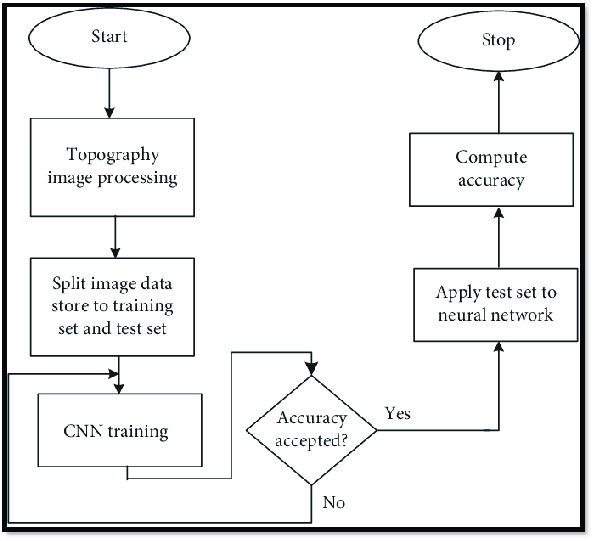

# CSE 151A  - AI-Driven Grading: Automating Pokémon Card Valuation with Machine Learning

## Milestone 5 - Final Submission

## Introduction

The objective of this project is to develop a machine learning model that accurately predicts the grade and quality of a Pokémon trading card based solely on its image. Pokémon card grading is a cornerstone of the massive trading card collecting community, which blends nostalgia, fandom, and the allure of high-value collectibles. As fans of both Pokémon and the world of trading card collecting, we recognize how grading defines the value of a card. For instance, a single pristine card can be worth thousands of dollars, while a slightly damaged version of the same card might only be worth pennies. This vast discrepancy in value underscores the importance of accurate and reliable grading.

However, the current grading process is far from perfect. It involves sending cards to one of a few respected grading companies, such as PSA, BGS, or CGC, and waiting weeks—if not months—for the results. Additionally, the cost per card can quickly add up, making the process both time-consuming and expensive for collectors. Moreover, human graders, while skilled, can introduce variability, subjectivity, or even occasional errors into the grading process.

Our model aims to provide an accessible and efficient alternative by analyzing an image of a trading card and outputting a predicted grade along with a confidence score. This can serve as a preliminary assessment for collectors, helping them decide whether a card is worth submitting for professional grading. By empowering collectors with immediate and objective feedback, this tool can streamline the decision-making process and reduce unnecessary grading submissions.

Beyond the immediate application, this project highlights the broader potential of machine learning in collectible markets. A highly accurate predictive model could revolutionize how collectible items like trading cards, coins, stamps, or even sports memorabilia are valued and authenticated. Such models could democratize grading by removing barriers like cost and wait times, making it accessible to a wider audience. Additionally, it could standardize grading practices, reduce human subjectivity, and foster greater transparency and trust in collectible markets.

The broader implications of this work extend beyond collectibles. By leveraging computer vision and machine learning to assess physical objects, industries such as quality control, art appraisal, and antiques authentication could also benefit. For example, automating the evaluation of physical goods could lead to faster, more accurate, and scalable assessments in fields where manual inspection has long been the standard.

## Figures

### Image Processing

The most common dimensions are ~600x800 at a 0.75:1 aspect ratio. We decided to fit the images into size 384x512 which maintains this aspect ratio and improves efficiency of training. This was achieved by scaling all images to fit within the dimensions while preserving their original aspect ratios, and then filling the background with black.

Some simple data augmentation was also applied to the images, including small shifts, rotations, and flips. This is beneficial for CV models to improve generalizability.

### Model Flowcharts

Model 1: Resnet 50 Transfer Learning

Model 2: Convolutional Neural Network (CNN)

## Milestone 4 - Model 2 and Evaluation

Image processing, model training, and evaluation can be found in [model2.ipynb](https://github.com/brendan887/pokemon-card-grader/blob/main/model2.ipynb).

We decided to try using a Convolutional Neural Network (CNN) model to see if we could see different results. This consisted of the same image processing of the first model, but used a different architecture to look at our data. Online research showed that Convolutional Neural Networks (CNN) are the most suitable choice for image-based tasks like ours. It's benefits include: feature extraction from images, parameter efficiency, etc.

### Image Processing 

This remains the same as it did for our first model.

The most common dimensions are ~600x800 at a 0.75:1 aspect ratio. We decided to fit the images into size 384x512 which maintains this aspect ratio and improves efficiency of training. This was achieved by scaling all images to fit within the dimensions while preserving their original aspect ratios, and then filling the background with black.

Some simple data augmentation was also applied to the images, including small shifts, rotations, and flips. This is beneficial for CV models to improve generalizability.

### Training and Validation

### Evaluation

#### Training Accuracy:

The training accuracy starts relatively low and slowly increases over the epochs, but the increase is very modest, with final accuracy just around 30%.
This indicates that the model is learning but very slowly.

#### Validation Accuracy:

The validation accuracy fluctuates throughout the epochs without a clear upward trend.
It also remains quite low, hovering around 28–30%.

The low and fluctuating validation accuracy indicates that the model struggles to generalize to unseen data.

### Training Loss:

The training loss sharply decreases in the first epoch and then stabilizes, but remains relatively high.
This shows that the model is learning but not optimally.

### Validation Loss:

The validation loss remains relatively flat and doesn't show significant improvement. It even seems to slightly diverge from the training loss in later epochs.

- Underfitting: The model is not complex enough to capture the patterns in the data.
- Insufficient Training Data: The dataset might be too small for the model to learn effectively. Although I don't think this is the case as we have a sufficent amount of data images.

### Suggestions for Improvement
It is evident that our model is insufficient to make accurate predictions on our data. Given our observations, here are some possible directions that we hope to investigate for our next milestone:

- Increased depth of model if continuing with CNN: the model cannot capture the required patterns in the data required to make accurate predictions, as discussed previously, though this is unlikely to achieve much better accuracy
- Oversampling when training: the model can be trained with more than one instance for each card with different sets of augmentations (the current training methodology involves only one instance of each card with one set of augmentations)
- Using a vision transformer model: according to our research, ViTs tend to work better with larger datasets, which may beneficial especially if we adopt an oversampling strategy (above) that significantly grows the dataset
- Models with two input heads: the grading of a card relies on both the front and back of a card; our current implementation only takes the front as input. A model with two input heads can potentially be employed to take both the front and back images of an instance simultaneously to make a prediction. Similarly, a front and back image of a card instance can be concatenated and pass in as one input image. This would be a highly intensive and challenging iteration as it would require collection of corresponding back images for the cards in our dataset, and a model with two heads is a lot of additional complexity and may be unstable.

### Predictions of Correct and FP and FN

More details on this can be found at the end of the notebook in [model2.ipynb](https://github.com/brendan887/pokemon-card-grader/blob/main/model2.ipynb). Here we calculate the predictions and build a confusion matrix. We also visualize some of the FP/FN, as well as correct predictions. 

### Conclusion 
For this milestone, we attempted to create our own CNN model rather than transfer learning to control the complexity of the model. This has also allowed us to address batch size issues with ResNet50 that led to epochs with 0 accuracy during training last milestone - this has now been amended by using our own model.

The direction we took with this model was to test our data-to-model complexity alignment. This is because our previous iteration used ResNet50 - a model that generally excels at classification - with transfer learning, which achieved a relatively low accuracy. As such, we attempted a shallower CNN to experiment if the large model was too complex to converge. Comparing results between both models, there is no marked difference. From this observation, we can likely conclude that a standard CNN will be ineffective regardless of model complexity/depth. In addition to the suggetions for improvement, additional models in the pipeline may be useful for improving results, such as an additional classification model that verifies if a card is evident in an image and roughly exceeds a certain image. 

## Milestone 3 - Preprocessing

Image processing, model training, and evaluation can be found in [model.ipynb](https://github.com/brendan887/pokemon-card-grader/blob/main/model.ipynb).

In this milestone, we completed data scraping as proposed in MS2. As we're working with image data, it is necessary to standardize the image size.

### Image Processing

The most common dimensions are ~600x800 at a 0.75:1 aspect ratio. We decided to fit the images into size 384x512 which maintains this aspect ratio and improves efficiency of training. This was achieved by scaling all images to fit within the dimensions while preserving their original aspect ratios, and then filling the background with black.

Some simple data augmentation was also applied to the images, including small shifts, rotations, and flips. This is beneficial for CV models to improve generalizability.

### Training and Validation

ResNet50 was used for transfer learning.

The best validation accuracy achieved was 0.3093 with a corresponding train accuracy of 0.3876.

### Where does your model fit in the fitting graph? 

Train Loss (blue line):

- Consistently decreases over epochs, which means the model is learning on the training data.

Validation Loss (orange line):

- Decreases initially but starts to plateau and fluctuate, with a gap forming between the training and validation loss.

This pattern suggests that the model might be slightly overfitting. The model is performing well on the training data (low training loss) but struggles to generalize as indicated by the validation loss not decreasing at the same rate or fluctuating.

### What are the next models you are thinking of and why?

We can't fully conclude which model improvements need to made here. However we can start to think about using pre-existing image models using transfer learning with ResNet or train a custom UNet from scratch. We can also include L1/L2 regularization to address overfitting, this could help our model generalize better. 

### Conclusion

The model accuracy indicates that it is only slightly better than random selection (there are 4 classes; random would be ~0.25). However, rather than improving the classification model itself, we propose further processing the dataset. Given the task of classification into different grades, the only pertinent information in a given image is the card itself. Looking at the preview of the data augmentation, we can see some issues:

- Some images have more than one card included
- Cards can be highly skewed
- Size of cards in images may vary
- Some images include irrelevant information (i.e. background)
- PSA label contains information of the card class, which should not be given to the model

As the task at hand relies on analyzing the card itself in great detail, we need to be able to eliminate the above factors. A solution is a segmentation model to crop out and flatten cards from the image, and identify and discard images with multiple cards/no cards/no unobstructed cards.

As for the model itself, more experimentation on architectures can be conducted, including training our own model from scratch.

## Milestone 2 - Data Exploration and Initial Processing

Since we are scraping our own data, we can design our own dataset as a preprocessing step. This way, we ensure that the dataset is representative of cards that we are interested in and has a sufficient representation of cards with different features. These features include but are not limited to:

- Card type (Pokemon vs. trainer)
- Art size (half art vs. full art)
- Special variant (EX, GX, VMAX, etc.)

We have decided to scrape card images for **the top 10 most valuable cards for each set** as of 11/3/24 (with the exception of few cards that have a completely different appearance to standard cards), with a total of 978 different cards. The complete card list can be found in [here](https://docs.google.com/document/d/1S45M2bVT3rBX15cnimlXmRDwiepWfXl3hs9HDs8nDyU/edit?usp=sharing). Significant effort was required to generate this list, as well as to create a cleaned version available in `config.py`. This query provides a good distribution of cards as it automatically includes cards for each generation and the special variants for each of these generations.

For each card, we have attempted to collect 2 images for each of the following classes, though not all grades were found for each card.

- PSA 10
- PSA 9
- PSA 8
- PSA 7

This ensures that the distribution of data between classes is close to even.

### Feature Distribution

| Feature               | Count |
| --------------------- | ----- |
| Pokemon               | 789   |
| Trainer               | 189   |
| Full Art              | 187   |
| Non-Full Art\*        | 791   |
| GX                    | 72    |
| EX\*\*                | 216   |
| V                     | 42    |
| VMAX                  | 45    |
| Total Different Cards | 978   |

\*Some cards can have art spanning the card, but are not offically "Full Art" cards

\*\*There are multiple generations of different types of EX cards, so this number is higher. It is difficult to check the exact distribution between these generations without manually verifying each card.

### Class Distribution (Collection in progress)

| Class          | Count |
| -------------- | ----- |
| PSA 10         | 214   |
| PSA 9          | 280   |
| PSA 8          | 256   |
| PSA 7          | 172   |
| Total Examples | 992   |

Due to API rate limits and time required to scrape all the image data, data is still being collected as of writing. We expect >8000 examples upon completion. Given the data collected so far, the distribution between classes is quite even. Though unlikely, should the distribution be significantly skewed, we can only consider the minimum count across all classes to enforce an equal distribution.

As we are handling image data, each image has pixel values ranging from 0-255. Min-max normalization is used to scale values to 0-1.

A portion of the dataset can be found [here](https://drive.google.com/drive/folders/1NuAWu848ER3avx0a-dhP88j1xvQZjNTi?usp=sharing). This does not include the entire dataset given its size.

## Milestone 1 - Abstract

When a collector wants to validate the authenticity and quality of a trading card, they send in their cards to an authenticating company who will give the card a grade, usually from 1-10. The objective of this project is to develop a machine learning model that accurately predicts the grade/quality of a Pokémon trading card based on its image. The approach involves collecting a comprehensive dataset of images of graded cards, each annotated with its official grade. Data preprocessing techniques such as cropping to isolate the card and perspective transformation to correct for angular distortions will be used to improve the quality of the data. One solution is to train a supervised CNN to learn the visual features associated with different grading levels, such as centering, whitening, and scratching. This model aims to output a confidence score for the card's grade when presented with a new image. Another solution that will be explored is performing feature extraction and distance calculation from a perfect example of the card. These models can help evaluate the efficacy of either solution and advise if a card is worth grading.
